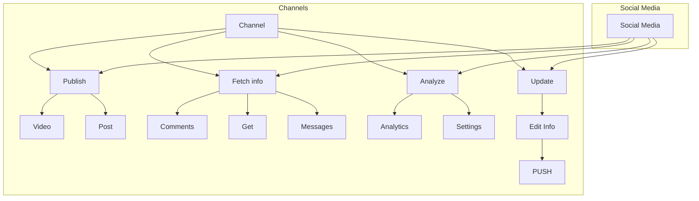
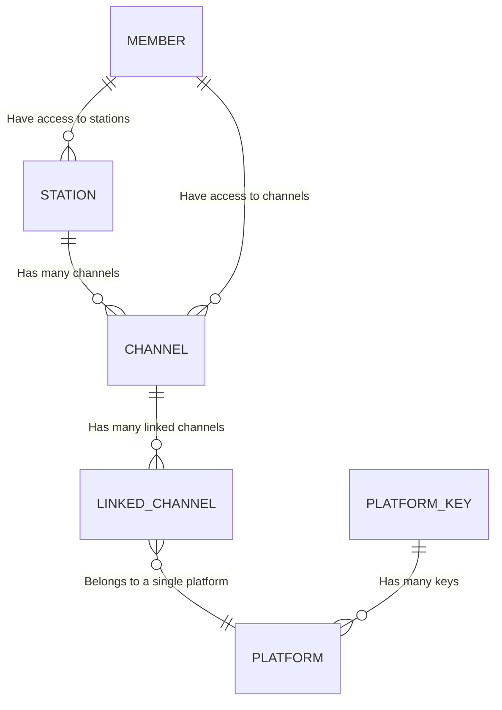
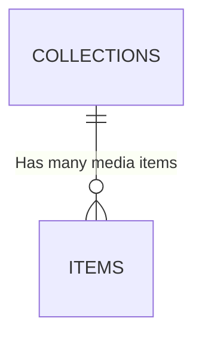
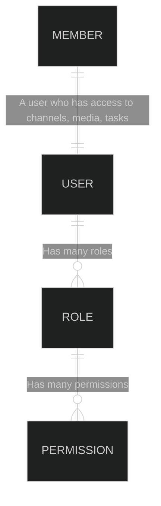
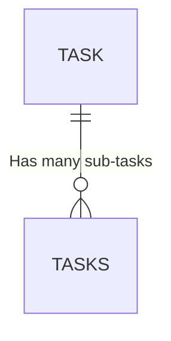
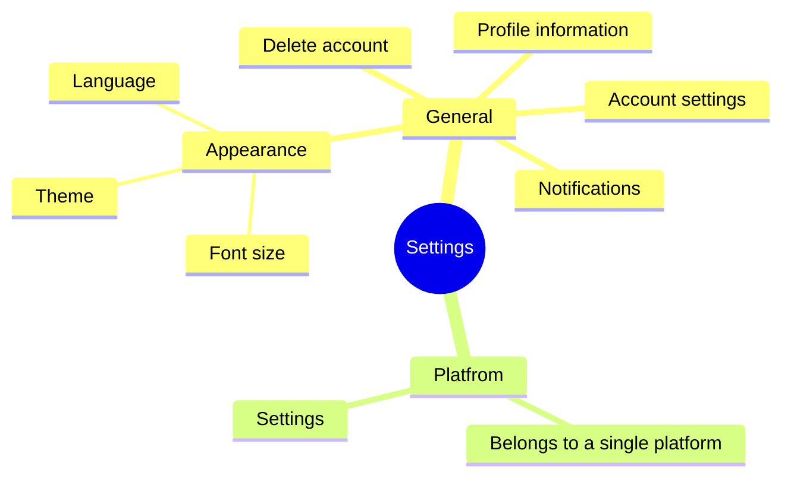

# Workflow

```mermaid
flowchart TB
    subgraph ide1 [Channels]
    A["Channel"] --> P["Publish"] & F["Fetch info"] & Z["Analyze"] & U["Update"] 
    P --> B["Video"] & POST["Post"]
    F --> C["Comments"] & GET["Get"] & M["Messages"]
    Z --> D["Analytics"] & S["Settings"]
    U --> E["Edit Info"]
    E --> PUSH
    end
    subgraph ide2 [Social Media]
    SOCIAL["Social Media"] --> P & F & Z & U
    end
```

# Database Schema
## Channels

```mermaid
erDiagram
    STATION ||--o{ CHANNEL : "Has many channels"
    CHANNEL ||--o{ LINKED_CHANNEL : "Has many linked channels"
    LINKED_CHANNEL }o--|| PLATFORM : "Belongs to a single platform"
    PLATFORM_KEY ||--o{ PLATFORM : "Has many keys"
    MEMBER ||--o{ CHANNEL : "Have access to channels"
    MEMBER ||--o{ STATION : "Have access to stations" 
```

## Media

```mermaid
erDiagram
    COLLECTIONS ||--o{ ITEMS : "Has many media items"
```

## Users

```mermaid
%%{init: {'theme':'dark'}}%%
erDiagram
    USER ||--o{ ROLE : "Has many roles"
    ROLE ||--o{ PERMISSION : "Has many permissions"
    MEMBER ||--|| USER : "A user who has access to channels, media, tasks"
```

## Tasks

```mermaid
erDiagram
    TASK ||--o{ TASKS : "Has many sub-tasks"
```

## Settings

```mermaid
%%{init: {'theme':'forst'}}%%
mindmap
  root((Settings))
    General
      Profile information
      Account settings
      Appearance
        Language
        Theme
        Font size
      Notifications
      Delete account
    Platfrom
      Belongs to a single platform
      Settings
    
```
